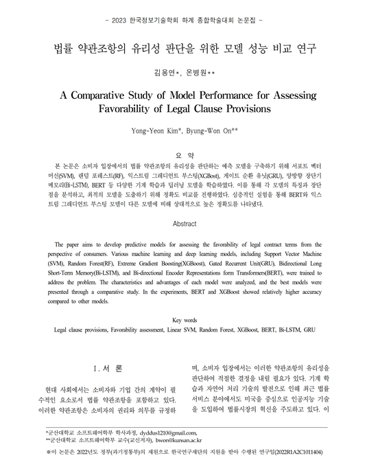
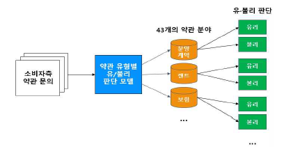
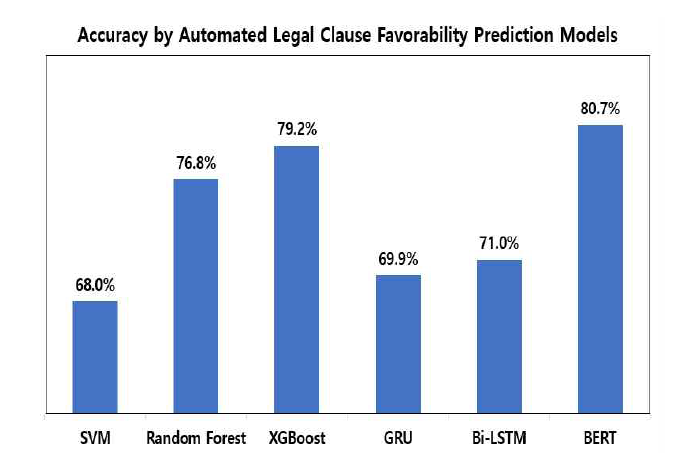

# 2023 KIIT Conference - 법률 약관조항의 유리성 판단을 위한 모델 성능 비교 연구


## 프로젝트 개요

이 프로젝트는 2023년 한국정보기술학회 하계 종합 학술대회에서 발표된 "법률 약관조항의 유리성 판단을 위한 모델 성능 비교 연구"의 일환으로, 약관 데이터를 분석하고 다양한 머신러닝 및 딥러닝 모델을 구축하여 약관의 유리/불리 여부를 분류하는 것을 목표로 합니다.

## 디렉토리 구조

- `datasets/`: 학습 및 검증 데이터셋을 포함합니다.
  - `train/약관/`: 원본 훈련 JSON 데이터셋
  - `valid/약관/`: 원본 검증 JSON 데이터셋
  - `train.csv`: 전처리된 훈련 데이터셋
  - `valid.csv`: 전처리된 검증 데이터셋
- `models/`: 모델 정의 스크립트와 학습된 모델 파일을 포함합니다.
  - `log/`: 모델 학습 로그 및 저장된 최적 모델 파일을 포함합니다.
  - `bert_model.py`: BERT 모델을 이용한 학습 및 평가 스크립트.
  - `bilstm_model.py`: Bi-LSTM 모델을 이용한 학습 및 평가 스크립트.
  - `gru_model.py`: GRU 모델을 이용한 학습 및 평가 스크립트.
  - `rf_model.py`: Random Forest 모델을 이용한 학습 및 평가 스크립트.
  - `svm_model.py`: SVM 모델을 이용한 학습 및 평가 스크립트.
  - `xgb_model.py`: XGBoost 모델을 이용한 학습 및 평가 스크립트.
- `images/`: 논문 관련 이미지 (아키텍처, 결과, 타이틀)를 포함합니다.
  - `architecture.png`: 모델 아키텍처 다이어그램
  - `result.png`: 실험 결과 이미지
  - `title.png`: 논문 타이틀 이미지
- `data_preprocessing.py`: JSON 형식의 원본 데이터를 CSV 형식으로 전처리하는 스크립트.
- `LICENSE`: 프로젝트 라이센스 파일.
## 시작하기

### 1. 환경 설정

필요한 라이브러리를 설치합니다.

```bash
pip install pandas numpy tensorflow scikit-learn transformers keras_preprocessing xgboost
```

### 2. 데이터 전처리

원본 JSON 데이터를 `datasets/train.csv` 및 `datasets/valid.csv` 파일로 변환합니다.

```bash
python data_preprocessing.py
```

### 3. 모델 학습 및 평가

각 모델 스크립트를 실행하여 모델을 학습하고 평가할 수 있습니다.

#### BERT 모델

```bash
python models/bert_model.py
```

#### Bi-LSTM 모델

```bash
python models/bilstm_model.py
```

#### GRU 모델

```bash
python models/gru_model.py
```

#### Random Forest 모델

```bash
python models/rf_model.py
```

#### SVM 모델

```bash
python models/svm_model.py
```

#### XGBoost 모델

```bash
python models/xgb_model.py
```

## 실험 결과

### 모델 구조


### 결과


## 라이센스

이 프로젝트는 MIT 라이센스를 따릅니다. 자세한 내용은 `LICENSE` 파일을 참조하십시오.
